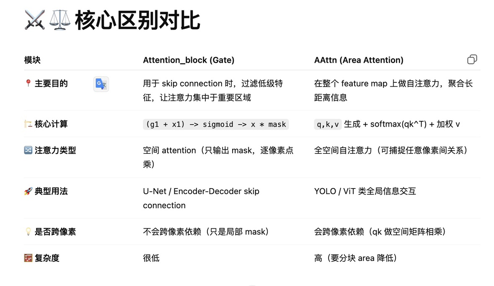

# 项目简介：
使用YOLOv12+Deepsort实现目标检测和追踪计数。

## 封装目标检测（YOLOv12）和多目标跟踪（Detection-Tracking Integration）

```python
class TargetDetector:
    def __init__(self, weights_path):
        self.model = YOLO(weights_path)
        self.names = self.model.names
        self.faceTracker = collections.defaultdict(lambda: 0)

    def detect(self, image):
        results = self.model.predict(
            source=image,
            conf=0.25,
            imgsz=640,
            verbose=False
        )
        bboxes = []
        for box in results[0].boxes:
            x1, y1, x2, y2 = map(int, box.xyxy[0].cpu().numpy())
            conf = float(box.conf[0].cpu().numpy())
            cls_id = int(box.cls[0].cpu().numpy())
            lbl = self.names[cls_id]

            if lbl in ['person', 'car', 'truck']:
                bboxes.append((x1, y1, x2, y2, lbl, conf))

        return results, bboxes

    def feedcap(self, im):
        retdict = {
            'frame': None,
            'vehicle_crops': None,
            'list_of_ids': None,
            'vehicle_bboxes': []
        }
        im, vehicle_crops, vehicle_bboxes, list_of_ids = update_tracker(self, im)

        retdict['frame'] = im
        retdict['vehicle_crops'] = vehicle_crops
        retdict['vehicle_bboxes'] = vehicle_bboxes
        retdict['list_of_ids'] = list_of_ids

        return retdict
```

## 运行 Demo

```
python demo.py
```

## yolo v12 中加入attention机制与之前 unet 中 attention 模块的区别



## 在 YOLOv12 Area Attention 中：

```python
Input: X (B×C×H×W)

1. 将 X 切成多个 block
   => [B, num_blocks, block_tokens, C]

2. 在每个 block 内做线性映射：
   Q_block = X_block @ W^Q
   K_block = X_block @ W^K
   V_block = X_block @ W^V

3. 在每个 block 内计算 attention：
   Softmax(Q_block * K_block^T / sqrt(d)) @ V_block

4. 将所有 block 的输出 reshape 回原图
```

